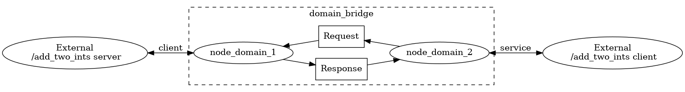

# domain_bridge Design

This article documents the design of the domain_bridge.

## Background

A ROS 2 network can be partitioned by assigning *nodes* (more specifically, *contexts* associated with nodes) different *domain IDs*.
A domain ID is simply an integer.
Nodes with different domain IDs cannot directly communicate with each other.
This is useful for avoiding interference and reducing network traffic, for example.
For more information, check out [this article about DDS domains from RTI](https://community.rti.com/static/documentation/connext-dds/5.2.3/doc/manuals/connext_dds/html_files/RTI_ConnextDDS_CoreLibraries_UsersManual/Content/UsersManual/Fundamentals_of_DDS_Domains_and_DomainPa.htm).

However, there are applications that would like to be able to share *some* data between different ROS 2 domains.
Therefore, it would be nice to have the ability to "bridge" a smaller set of ROS network traffic across domains, hence the *domain_bridge*.

## Requirements

The following are a set of requirements we would like our domain bridge to meet:

1. Bridge ROS topics from one domain to another.

There should be a way for nodes in different domains to communicate with each other using ROS topics.
This should be configurable on a per-topic basis.
I.e. if there is a topic being published on domain *A*, there should be a mechanism to allow for subscriptions to the topic in another domain *B*, where *A* != *B*.

2. Bridge ROS services from one domain to another.

The same as (1), but for ROS services.

3. Bridge ROS actions from one domain to another.

The same as (1), but for ROS actions.

4. No explicit dependencies on ROS interface types

The bridge should work with any supported ROS type (e.g. .msg, .srv, .action, or .idl).
Furthermore, the bridge should not have to declare any explicit dependencies on interfaces types (e.g. in code or package.xml).
Ideally, the bridge can just deal with serialized data, though it may be necessary to dynamically load type support at runtime.

5. Accurately bridge Quality of Service settings

All ROS communication entities (e.g. publishers and service clients) have [Quality of Service (QoS)](http://design.ros2.org/articles/qos.html) settings associated with them.
The bridge should faithfully map the QoS settings of data coming from one domain into another domain.
For example, a publisher with reliability policy set to "best effort" should continue to publish as "best effort" in the other domains when bridged.

If there are multiple publishers on the same topic, but with different QoS settings, it would be nice if the bridge could preserve each stream of data.
For example, if there is one publisher using "best effort" and another publisher using "reliable" on the same topic (with the same domain ID) and a bridge is made,
then the bridge should forward data as "best effort" for the first publisher and as "reliable" for the second publisher into the output domain.
Unfortunately, this may not be possible due to technical limitations so we leave this as a soft requirement.
Refer to the *QoS mapping* section of the proposed approach below for a more detailed discussion.

Since remotely querying the *history* and *depth* QoS policies is not possible in many implementations (e.g. it is not required by the DDS spec),
the bridge should offer a way to configure these values explicitly.
This is important so that users can configure the bridge to avoid exceeding the history queue depth, resulting in lost messages.

6. Remapping

[Remapping](https://design.ros2.org/articles/static_remapping.html) is a generally useful concept in ROS.
The bridge should support remapping topic, service, and action names when mapping the name from one domain to another.
It is possible to bridge different topic names with the same name from different domains, so we should keep this in mind when it comes to remapping names.

For example, users may want to remap topic `/foo` in domain ID `1` to a different name `/bar` in domain ID `2`.

7. Easily configurable

Since the set of bridged data depends on the application, we need an easy way to configure what data is bridged.
Users should be able to specify the following information at an API level:

- The domain IDs that should be bridged
- The topic names and types that should be bridged (same for services and actions)
- History and depth QoS policies for each topic bridged
- Remappings of topic, service, and action names
- Optionally, it could be useful to override QoS settings for each entity being bridged.

Not only should the bridge be configurable at an API level, but there should also be a way to configure it without having to change code (e.g. a passed in YAML or XML file).

8. Security

The bridge should not subvert [Secure ROS 2](https://github.com/ros2/sros2) (SROS 2) mechanisms.
Similarly, SROS 2 should not prevent the domain bridge from working correctly (i.e. the bridge should not break with security enabled).

Consider that it is possible for a user to only secure half of a domain bridge (i.e. only one domain has security enabled).
This means that a bridged topic, though secure in one domain, is left completely open in another domain.
Presuming that there is no straight-forward solution to enforcing that both sides of a bridge are secured, the least we can do is make sure users are well-informed of this potential security vulnerability.
Additionally, tools may be provided to help streamline securing a ROS system with a domain bridge.

## Approach

The proposed solution involves several nodes in a single bridge process.
For each unique domain ID involved in the bridge process, a ROS context is created for that domain ID and a node is associated with the context.
Therefore, we end up with one node per context per domain ID, all inside a single process.
Bridged data will be shared between the nodes in the process so that it can be rebroadcast to a different domain.
Nodes will be created as needed, based on the configuration of the bridge.

For example, the following diagram illustrates a configuration where the "/chatter" topic from domain IDs `1` and `3` are both being bridged to domain ID `2`:


### API

A C++ library with a public API is provided for users to call in their own process and extend as they like.
The public API is expected to evolve over time, but at the very least users should be able to bridge ROS networks primitives.

For convenience, a standalone binary executable is also provided for easy integration into ROS systems.

### Supporting generic types

When bridging data, serialized data will be read from one domain and forwarded to another domain.
As long as the bridge does not need access to the typed data, there is no need for deserialization and, therefore, C++ type support.
In this way, we can handle arbitrary data coming from the middleware (as long as we load type support for the middleware).
The domain bridge currently leverages the generic publisher and subscription implementations available in rclcpp.

### QoS mapping

The QoS settings of a publisher can be queried by the bridge.
With this information, the bridge can create a subscription using the same QoS settings for receiving data.
The bridge can also create a publisher for the domain being bridged with the same QoS settings.
In this way, for the single publisher case, the QoS settings are preserved from one domain to another domain.
However, there are issues related to the *liveliness* policy as well as multiple publishers per topic that are discussed below.

We must consider the scenario when the domain bridge starts *after* the publisher of a bridged topic becomes available.
In this case, the bridge cannot know what QoS settings to use for the bridged topic.
The solution is to have the bridge wait until a publisher becomes available before creating it's own subscription and publisher for that topic.

#### Deadline

Due to possible delays induced by the bridge, it is possible that the original deadline of a publisher may not be met when forwarding to a different domain.
If a deadline is important for the user application, then it should be set manually on the bridge.
Therefore, by default, the bridge will use the RMW-defined default value for deadline (typically implying "no deadline").
Users may set the value manually or configure the bridge to use the original publisher's value.

#### Lifespan

The lifespan policy is closely coupled with the history policy.
Since the bridge is not able to automatically detect the history policy of publishers, it is safer to let the user configure lifespan given their application-specific knowledge.
For similar reasons as the deadline policy, by default the bridge will use the RMW-defined default value for the lifespan policy.
Likewise, users can set the value manually or configure the bridge to use the original publisher's value.

#### Liveliness

The liveliness QoS policy can either be set to "automatic" or "manual by topic".
If it is "automatic", the system will use the published messages as a heartbeat to consider if the publisher's node is alive.
If it is "manual by topic", the node needs to manually call a publisher API to assert it is alive.

This poses a problem for the domain bridge.
If the liveliness of a publisher is "manual by topic", then the bridge cannot mimic the QoS behavior into another domain.
It would require the bridge to know when the original publisher is asserting its liveliness (i.e. calling the publisher API).
Since there is no mechanism in ROS 2 to get this information at the subscription site, the bridge cannot support "manual by topic" liveliness.
Therefore, the bridge will always use "automatic" liveliness, regardless of the original publisher's policy.

#### Multiple publishers

As mentioned in the requirements, if there are multiple publishers on the same topic, it would be nice if the bridge could preserve multiple streams of data, each with their own QoS settings.
Unfortunately, this is technically challenging because it is difficult to associate a ROS message received by a subscription with the publisher that originally published the message.
Consider the following scenario:

1. Publisher *A* publishes on topic "chatter" with a QoS reliability setting of *reliable*.
2. Publisher *B* publishes on topic "chatter" with a QoS reliability setting of *best effort*.
3. In order to receive a message from *B*, we must create a subscription with a QoS reliability setting of *best effort*.
4. The subscription will also receive messages from *A*, since *best effort* subscriptions also matches with *reliable* publishers.

If we cannot distinguish whether a message came from publisher *A* or publisher *B*, then we cannot know what QoS settings to use for the message when publishing into another domain.

Instead, the proposed approach will do as best it can to ensure all messages make it across the bridge.
The bridge will evaluate the QoS settings of all publishers and modifiy the QoS settings of the bridges subscription and publisher
such that it matches the majority of the available publishers for a given topic.
For example, given publisher *A* and publisher *B* from the aforementioned scenario, the bridge would select a reliability setting of best effort since it matches with both publishers.

For *deadline* and *lifespan* policies, if the user has opted into automatic matching, the bridge will use the max value given the policy value for all publishers.
For example, if a publisher *A* has a larger deadline than publisher *B* (and *A* and *B* publish to the same topic), then the bridge will use the deadline value of publisher *A*.

The bridge will decide on the QoS settings as soon as one or more publishers is available.
This means it is possible that publishers joining after the topic bridge is created may have compatibility issues, and fail to have their messages bridged.
For example, in the following scenario, messages coming from publisher *B* will not be bridged:

1. Publisher *A* for topic "chatter" with a QoS reliability setting of *reliable* is created.
2. A topic bridge is created for topic "chatter".
3. Publisher *B* for topic "chatter" with a QoS reliability setting of *best effort* is created.

We consider having multiple publishers with different QoS policies on the same topic to be rare in practice, and so do not try to handle the above scenario in the proposed approach.

### Waiting for subscription or publisher to bridge a topic

By default, we wait for an available publisher and use its QoS settings to create a topic bridge.
This can be modified by passing the command line arguments:

- `--wait-for-subscription true|false`, default false.
- `--wait-for-publisher true|false`, default true.

If both are true, first the domain bridge will wait for a publisher and then for a subscription, and use the publisher QoS to create the bridge.
If only wait for subscription is enabled, the QoS settings of the subscription found will be used.

### Remapping

When bridging topics, users can optionally give a name to remap the topic to in the destination domain.

Users can apply independent remaps for each domain that a topic is bridged to.
E.g. A topic can be bridged and remapped to a domain *B* and independently bridged and remapped to another domain *C*.

A remap can be provided exactly once for each unique bridge.
I.e. users can not remap a topic from a domain *A* to another domain *B* more than once.

Remap names support the node name substitution symbol (`~`).
If this substition appears in a remap name, then it is replaced by the name of the domain bridge.

### Configuration

The [YAML](https://yaml.org/) language was chosen as an easy way to externally configure the domain bridge.
YAML is relatively simple to read for humans and computers alike and is commonly used in other places of the ROS ecosystem (e.g. ROS parameters).

The name of the bridge can be set with the optional key, `name`.
The bridge name is used for naming nodes and logging, for example.

Default domain IDs for bridged entities can be set as top-level keys:

- `from_domain`, data will be bridged from this domain ID by default.
- `to_domain`, data will be bridged to this domain ID by default.

The `topics` key is used to specify what topics to bridge.
It expects a map of topic names to topic-specific configuration key-value pairs.
List of supported configurations pairs:

- `type` (required), the ROS message type for the topic.
- `from_domain` (optional), overrides the default `from_domain`.
- `to_domain` (optional), overrides the default `to_domain`.
- `qos` (optional), a map of QoS policies names to values.
  Any values provided in this map will override values set by the automatic QoS matching mechanism.
- `remap` (optional), remap the topic to this name in the destination domain (`to_domain`).

Similar to topics, services and action to bridge may be specified with the `services` and `actions` keys respectively.

The `qos` map accepts the following key-value pairs:

- `reliability`, can be `reliable` or `best_effort` (default: matches publishers).
- `durability`, can be `volatile` or `transient_local` (default: matches publishers).
- `history`, can be `keep_last` or `keep_all` (default: `keep_last`).
- `depth`, only applies if `history` is `keep_last`. Must be an integer (default: `10`).
- `deadline`, an integer representing nanoseconds or the string 'auto' (default: `-1`).
   A negative value implies an infinite deadline.
   If set to 'auto' then it will match an available publisher.
- `lifespan`, an integer representing nanoseconds or the string 'auto' (default: `-1`).
   A negative value implies an infinite lifespan.
   If set to 'auto' then it will match an available publisher.

Here is an example of a configuration file for bridging multiple topics, a service, and an action:

```yaml
name: my_domain_bridge
from_domain: 2
to_domain: 3
topics:
  # Bridge "/foo/chatter" topic from doman ID 2 to domain ID 3
  # Automatically detect QoS settings and default to 'keep_last' history with depth 10
  foo/chatter:
    type: example_interfaces/msg/String
  # Bridge "/clock" topic from doman ID 2 to domain ID 3,
  # Override durability to be 'volatile' and override depth to be 1
  clock:
    type: rosgraph_msgs/msg/Clock
    qos:
      durability: volatile
      depth: 1
  # Bridge "/clock" topic from doman ID 2 to domain ID 6
  # Automatically detect QoS settings and override history to 'keep_all'
  clock:
    type: rosgraph_msgs/msg/Clock
    to_domain: 6
    qos:
      history: keep_all
  # Bridge "/chitter" topic from domain ID 2 to domain ID 3 with the name "/chatter"
  chitter:
    type: example_interfaces/msg/String
    remap: chatter

services:
  # Bridge "add_two_ints" service from domain ID 4 to domain ID 6
  add_two_ints:
    type: example_interfaces/srv/AddTwoInts
    from_domain: 4
    to_domain: 6

actions:
  # Bridge "fibonacci" action from domain ID 1 to domain ID 3
  fibonacci:
    type: example_interfaces/action/Fibonacci
    from_domain: 1
```

### Security

TODO

## Alternatives

### SOSS

[System Of Systems Synthesizer](https://soss.docs.eprosima.com/en/latest/index.html) allows communication among an arbitrary number of protocols that speak different languages.
It can be [used as a ROS 2 domain bridge](https://github.com/osrf/soss/blob/f5471497751d5f8e8eb63d728614074e295b2666/examples/sample_ros2_domain_change.yaml).

Pros:
- A good choice if you also want to bridge different middlewares (not just ROS 2).

Cons:
- Requires generating/building SOSS type support for every interface being bridged.
- Slightly less performant due to extra data marshaling.

### Handling multiple publishers

It's possible that the bridge could dynamically adjust to new publishers joining the network for an existing topic bridge.
For example, the bridge could continuously monitor for new publishers and re-create it's subscription and publisher to reflect any necessary changes to QoS settings.
Though, it is possible that some messages may be missed during the re-creation of the subscription.

Pros:
- Better suited to systems where publishers with different QoS settings are created/destroyed during runtime

Cons:
- Not obvious how to handle missing messages during subscription re-creation
- Substantially more complex to implement.

### Bridging service

It is not currently possible to create a service or client with only the type name and topic name, thus we cannot bridge services dynamically from a configuration file.
It is possible though to do that statically, by using the `bridge_service()` template method:

```cpp
  domain_bridge::DomainBridge bridge;
  bridge.bridge_service<example_interfaces::srv::AddTwoInts>("add_two_ints", domain_1, domain_2);
```

That will bridge a service server from the domain `domain_1` to the domain `domain_2`, as shown in the following diagram:



You can create your own executable based in the one in `src/domain_bridge.cpp`, allowing your node to bridge topics based on a configuration files and also bridge some predetermined services!!!
